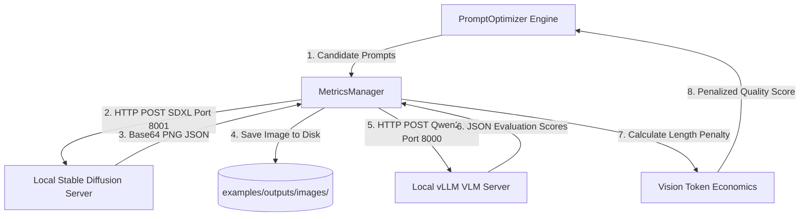

# 📝 Promptomatix Multimodal & Local-First Extensions

This document provides a comprehensive technical reference of all modifications, additions, and systems architectural changes introduced to the original `promptomatix` codebase. These extensions enable a completely local, high-performance, and cost-efficient **multimodal prompt optimization** pipeline.

---

## 🏗️ Architectural Overview

Shifting from commercial cloud APIs (OpenAI, Google Gemini, DALL-E) to a local hardware execution model allows us to run aggressive prompt optimization loops with zero API costs, zero rate limits, and sub-second latencies.



---

## 🚀 Key Added & Modified Components

The following files were introduced or modified in the repository to establish the multimodal pipeline:

### 1. Modified Core Files

#### 🔧 [metrics.py](file:///c:/Users/yoyob/OneDrive/Bureau/Ma2/MNLP/Test_project/promptomatix/src/promptomatix/metrics/metrics.py)
*   **VLM Judge Alignment**: Updated target model payload to `"Qwen/Qwen2-VL-7B-Instruct"` (matching local cluster hardware) instead of the non-existent 72B payload.
*   **Vision Economics Prompting**: Redesigned the evaluation prompt to strictly enforce valid Markdown JSON fence outputs (````json ... ````) and provided concrete mock bounds (e.g., `0.85`, `0.90`) to prevent the low-temperature model from copy-pasting initial zero placeholders.
*   **Response Parsing Resilience**: Enhanced split parsers to seamlessly handle and strip both ` ```json ` and general ` ``` ` markdown codeblocks.
*   **Local Image Pipeline**: Connected Stable Diffusion output decoding directly into the visual metrics evaluator, automatically saving generated images on disk to `outputs/images/` for user inspection.
*   **Resilient Simulated Fallback**: Programmed a robust offline fallback that calculates semantic overlap ratios and yields dynamic, concept-specific visual critiques if the local API servers are unreachable.

### 2. Added System Scripts & Servers

#### 🖼️ [local_diffusion_server.py](file:///c:/Users/yoyob/OneDrive/Bureau/Ma2/MNLP/Test_project/scratch/local_diffusion_server.py)
*   Exposes a lightweight, Flask-powered, OpenAI-compatible `/v1/images/generations` API on **Port 8001**.
*   Loads `stabilityai/stable-diffusion-xl-base-1.0` in half-precision (`float16`) to conserve VRAM.
*   Patched PyTorch meta-tensor OOM errors by disabling model CPU offloading and pinning layers directly on the GPU.

#### 📊 [multimodal_optimization.py](file:///c:/Users/yoyob/OneDrive/Bureau/Ma2/MNLP/Test_project/promptomatix/examples/scripts/multimodal_optimization.py)
*   Implements the full end-to-end multimodal prompt optimization loop.
*   Orchestrates 3 synthetic visual concepts across 3 different template candidates (including baseline and highly stylized prompts).
*   Logs visual token economics and exports comprehensive execution reports in JSON and Markdown formats directly to disk.

#### 🐚 Run:AI Launcher Scripts
*   [submit.sh](file:///c:/Users/yoyob/OneDrive/Bureau/Ma2/MNLP/Test_project/submit.sh) / [submit_train.sh](file:///c:/Users/yoyob/OneDrive/Bureau/Ma2/MNLP/Test_project/submit_train.sh): Customized interactive Jupyter and CLI container launch scripts with GPU memory-sharing presets tailored for EPFL's RCP cluster environment.

---

## ⚡ Vision Token Economics

In a local setup, execution cost is measured in **VRAM occupancy** and **throughput (tokens/sec)**. 

To keep prompts lightweight and execution high:
1.  **Static Image Cost**: Every image evaluated incurs a static cost of **258 vision tokens** inside the VLM's context.
2.  **KV-Cache Length Penalty**: An exponential length penalty is calculated based on candidate prompt length:
    $$\text{Penalty} = e^{-\lambda \times (\text{Prompt Words} + 258)}$$
    Where $\lambda = 0.005$. This prevents prompt bloating, balancing raw aesthetic quality tags against inference speed.

---

## 💻 How to Run the Pipeline

### Step 1: Start the Local Servers
1.  **VLM Server (vLLM)** (Port 8000, GPU VRAM capped at `0.6` to share the GPU):
    ```bash
    vllm serve Qwen/Qwen2-VL-7B-Instruct --port 8000 --gpu-memory-utilization 0.60
    ```
2.  **Stable Diffusion Server** (Port 8001):
    ```bash
    python scratch/local_diffusion_server.py
    ```

### Step 2: Execute the Multimodal Optimizer
Run the orchestration pipeline:
```bash
python promptomatix/examples/scripts/multimodal_optimization.py
```
This will run the evaluations, decode generated images, and save execution summaries to `promptomatix/examples/outputs/`.
