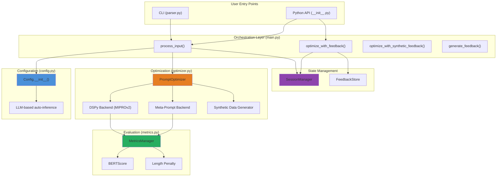
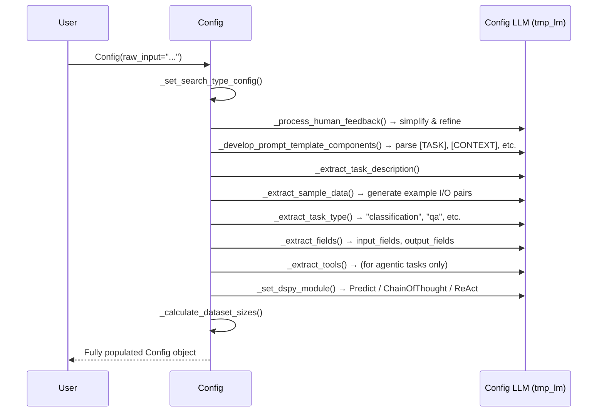
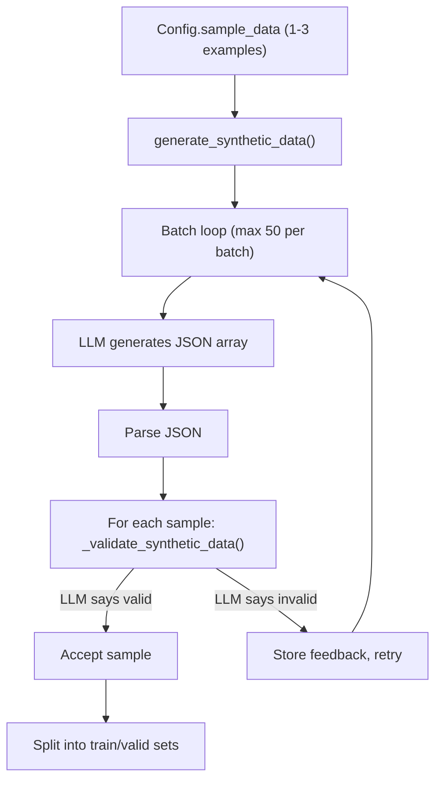
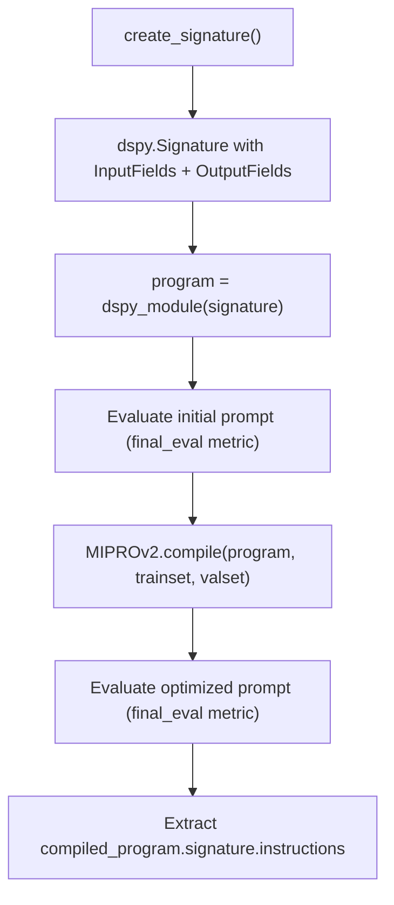
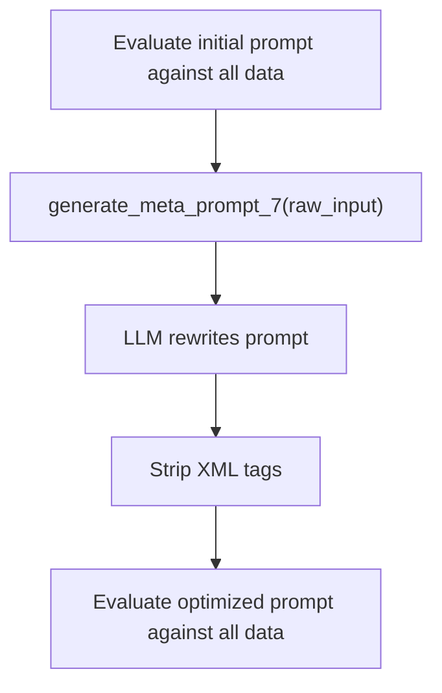
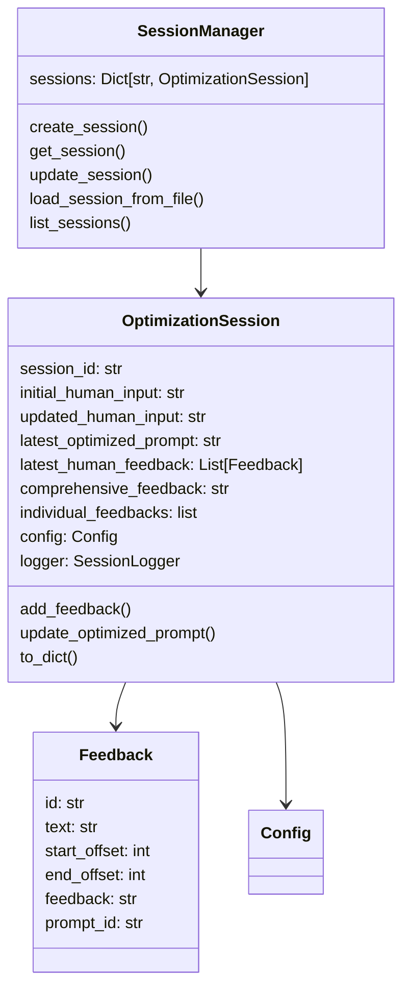
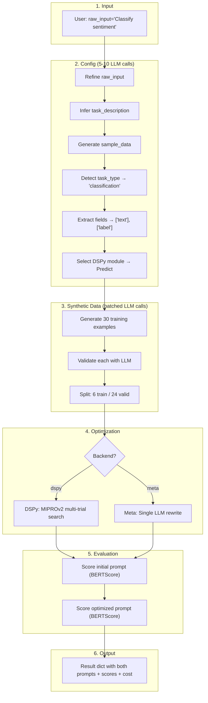
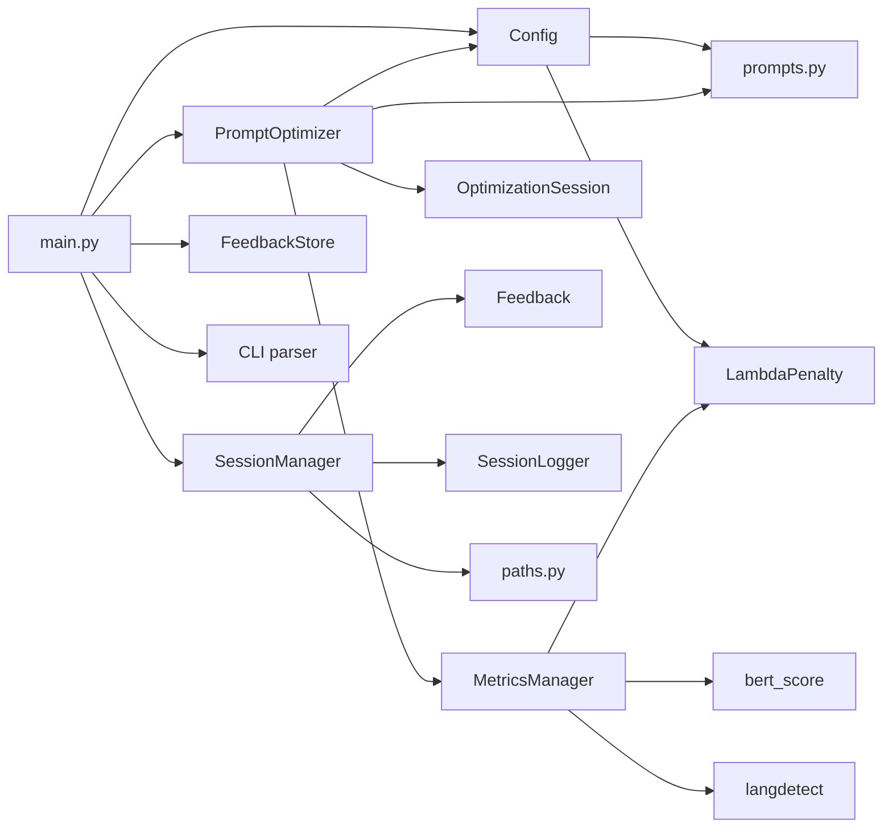

# Promptomatix — Full Architecture Walkthrough

> [!NOTE]
> Promptomatix is an automated **prompt optimization framework** that takes a user's rough task description and produces a refined, higher-scoring prompt — using synthetic data generation, LLM-based evaluation, and either DSPy's MIPROv2 optimizer or a simpler meta-prompt rewriting strategy.

---

## 1. Package Layout

```
promptomatix/src/promptomatix/
├── __init__.py              # Public API: process_input, optimize_with_feedback, save_feedback
├── main.py                  # Orchestrator — wires everything together (966 lines)
├── lm_manager.py            # Legacy LM factory (mostly unused, superseded by dspy.LM)
├── logger.py                # Standalone SessionLogger (duplicated in utils/)
│
├── core/
│   ├── config.py            # Config class — auto-infers all missing params via LLM (1761 lines)
│   ├── optimizer.py         # PromptOptimizer — runs the actual optimization (983 lines)
│   ├── prompts.py           # 3336 lines of prompt templates for every LLM call
│   ├── session.py           # OptimizationSession + SessionManager — state & persistence
│   └── feedback.py          # Feedback + FeedbackStore — user annotation data model
│
├── metrics/
│   └── metrics.py           # MetricsManager — 20+ task-specific BERTScore-based metrics (1503 lines)
│
├── cli/
│   └── parser.py            # argparse CLI entry point
│
└── utils/
    ├── paths.py             # PROJECT_ROOT, LOGS_DIR, SESSIONS_DIR constants
    ├── logging.py           # SessionLogger (app_log + dspy_log per session)
    └── parsing.py           # Smart-quote normalization, dict string parsing
```

---

## 2. High-Level Architecture



---

## 3. The Three Phases of Execution

Every optimization run flows through three distinct phases:

### Phase 1: Configuration (`Config.__init__()`)

### Phase 2: Optimization (`PromptOptimizer.run()`)

### Phase 3: Results & Session Management (`main.py`)

Let's walk through each.

---

## 4. Phase 1 — Configuration Auto-Inference

**File**: [config.py](file:///c:/Users/yoyob/OneDrive/Bureau/Ma2/MNLP/Test_project/promptomatix/src/promptomatix/core/config.py) (1761 lines)

The `Config` class is the most complex component. When you pass `raw_input="Classify movie reviews as positive or negative"`, it **automatically infers everything else** via a chain of LLM calls.



#### Key design decisions:

| What | How |
|------|-----|
| **Two LLMs** | `config_model_name` is the LLM used during configuration (auto-inference). `model_name` is the LLM used during actual task execution. They can be different (e.g. GPT-4 for config, Llama for task). |
| **Prompt template parsing** | If the user uses `[TASK]`, `[CONTEXT]`, `[FEW_SHOT_EXAMPLES]`, `[INSTRUCTIONS]`, `[RULES]`, `[OUTPUT_FORMAT]`, `[TOOLS]` tags in their raw_input, Config parses them into separate components and then improvises each one individually. |
| **HuggingFace datasets** | If `huggingface_dataset_name` is provided instead of `raw_input`, Config loads the dataset, infers the task description from it, and populates fields automatically. |
| **Search type presets** | `quick_search` (30 samples, 5 candidates, 10 trials), `moderate_search` (100 samples, 10 candidates), `heavy_search` (300 samples, 20 candidates, 30 trials). These control both synthetic data size AND MIPROv2 hyperparameters. |
| **Lambda penalty** | Stored as a class-level singleton `LambdaPenalty._value` (default 0.005). Configurable via `Config(lambda_penalty=0.01)`. |

#### Supported providers:

| Provider | Default Model | API Key Env Var |
|----------|--------------|-----------------|
| OpenAI | `gpt-4o` | `OPENAI_API_KEY` |
| Anthropic | `claude-3-sonnet` | `ANTHROPIC_API_KEY` |
| Gemini | `gemini-1.5-flash` | `GOOGLE_API_KEY` |
| TogetherAI | `Llama-3.3-70B-Instruct-Turbo` | `TOGETHERAI_API_KEY` |
| Databricks | — | `DATABRICKS_API_KEY` |
| Local | — | — (`localhost:8000`) |

---

## 5. Phase 2 — Optimization

**File**: [optimizer.py](file:///c:/Users/yoyob/OneDrive/Bureau/Ma2/MNLP/Test_project/promptomatix/src/promptomatix/core/optimizer.py) (983 lines)

Once Config is populated, `main.py` creates a `PromptOptimizer` and calls `run()`. The optimizer supports **two backends**:

### 5.1 Backend Choice

| Backend | When to use | How it optimizes |
|---------|-------------|-----------------|
| `dspy` | Complex tasks, multi-trial search | MIPROv2 gradient-free optimizer explores candidate prompts over multiple trials |
| `simple_meta_prompt` | Quick optimization, simpler tasks | Single LLM call rewrites the prompt using a meta-prompt |

### 5.2 Shared: Synthetic Data Generation

Both backends share the same data generation pipeline:



- **Batch sizing**: `min(50, 8000 / tokens_per_example)` — prevents exceeding context limits
- **Validation**: Each sample is sent back to the LLM with a validation prompt. The LLM returns `{"is_valid": bool, "feedback": str}`. Invalid samples' feedback is fed back into subsequent generation prompts (up to 3 retries per batch).
- **Default split**: 20% train, 80% validation (controlled by `train_ratio`)

### 5.3 DSPy Backend Flow



Key detail: **Two different metrics are used**:
- **Training metric** (`get_eval_metrics()`) — includes length penalty `e^{-λL}` → forces optimizer toward shorter prompts
- **Final eval metric** (`get_final_eval_metrics()`) — pure quality score for before/after comparison

### 5.4 Meta-Prompt Backend Flow



Evaluation works sample-by-sample: for each data point, the prompt is concatenated with the input fields, sent to the LLM, the response is wrapped into a prediction dict, and scored by `MetricsManager`.

### 5.5 LLM API Layer

The optimizer can call LLMs directly (bypassing DSPy) via `_call_llm_api_directly()`:

| Provider | Client | Special Features |
|----------|--------|-----------------|
| OpenAI | `openai.OpenAI` | Skips response cleanup for `o3` and `gpt-4.1` |
| Gemini | `google.generativeai` | Multimodal — loads images as PIL objects |
| Anthropic | `anthropic.Anthropic` | Uses `config_temperature` and `config_max_tokens` |

All track cost via `words × 1.3` token estimation.

---

## 6. Phase 3 — Results & Orchestration

**File**: [main.py](file:///c:/Users/yoyob/OneDrive/Bureau/Ma2/MNLP/Test_project/promptomatix/src/promptomatix/main.py) (966 lines)

### 6.1 `process_input(**kwargs)` — The Main Entry Point

This is the function users call. It:

1. Creates a `Config(**kwargs)` → auto-infers everything via LLM
2. Creates an `OptimizationSession` via `SessionManager`
3. Initialises `dspy.LM` and configures DSPy globally
4. Creates `PromptOptimizer(config)` and calls `run()`
5. Aggregates costs from both Config and Optimizer phases
6. Updates the session with the optimised prompt
7. Returns a result dict:

```python
{
    'result': str,                    # The optimized prompt
    'initial_prompt': str,            # The original prompt
    'session_id': str,
    'backend': str,
    'task_type': str,
    'input_fields': list,
    'output_fields': list,
    'metrics': {
        'initial_prompt_score': float,
        'optimized_prompt_score': float,
        'cost': float,                # Total estimated API cost
        'time_taken': float           # Wall-clock seconds
    },
    'synthetic_data': list            # All generated training data
}
```

### 6.2 Feedback Loop Functions

| Function | Purpose |
|----------|---------|
| `optimize_with_feedback(session_id)` | Retrieves the latest feedback from `FeedbackStore`, creates a new `Config` with `raw_input = "Prompt: {old_prompt}\n\nFeedback: {feedback}"`, and re-runs optimization |
| `optimize_with_synthetic_feedback(session_id, feedback)` | Same but with programmatic feedback instead of user annotations |
| `generate_feedback(prompt, ...)` | Runs the prompt against each synthetic sample, uses `o3` to critique each (input, expected, actual) triple, then uses `gpt-4o` to synthesise comprehensive feedback |
| `save_feedback(text, start, end, feedback, prompt_id)` | Stores a user annotation (with text offsets) in the `FeedbackStore` |

### 6.3 Session Management

**File**: [session.py](file:///c:/Users/yoyob/OneDrive/Bureau/Ma2/MNLP/Test_project/promptomatix/src/promptomatix/core/session.py)



Sessions are persisted as JSON files in `PROJECT_ROOT/sessions/`. Each session stores the full config, all feedback, and the prompt evolution history.

---

## 7. Evaluation Engine

**File**: [metrics.py](file:///c:/Users/yoyob/OneDrive/Bureau/Ma2/MNLP/Test_project/promptomatix/src/promptomatix/metrics/metrics.py) (1503 lines)

The `MetricsManager` provides task-aware scoring. See the [metrics walkthrough](file:///C:/Users/yoyob/.gemini/antigravity/brain/b24f3d4c-c21e-4ecd-b7bb-585e551669c7/artifacts/metrics_walkthrough.md) for full details. Summary:

| Metric Type | Formula Pattern | Used By |
|-------------|----------------|---------|
| Training metrics | `quality_score × e^{-λ × prompt_length}` | MIPROv2 during compilation |
| Final eval metrics | `quality_score` (no penalty) | Before/after score comparison |

The length penalty creates an **efficiency pressure**: the optimizer finds prompts that are both effective AND concise.

### Quality score strategies by task:

| Task | Strategy |
|------|----------|
| QA | `(exact_match + BERTScore_F1) / 2` |
| Classification | Exact match (binary) |
| Generation | `(fluency + creativity + gold_similarity) / 3` via BERTScore |
| Translation | BERTScore with auto-detected language |
| Multi-label | `(set_F1 + Hamming_similarity) / 2` |
| Paraphrasing | `0.7 × BERTScore + 0.3 × lexical_diversity` |
| Most others | `(BERTScore_vs_gold + BERTScore_vs_quality_ref) / 2` |

---

## 8. Prompt Templates

**File**: [prompts.py](file:///c:/Users/yoyob/OneDrive/Bureau/Ma2/MNLP/Test_project/promptomatix/src/promptomatix/core/prompts.py) (3336 lines)

This is the largest file — a library of prompt templates used throughout the system. Key categories:

| Category | Functions | Used During |
|----------|-----------|-------------|
| **Config inference** | `extract_task_description_from_raw_input`, `extract_task_type_from_raw_input`, `extract_fields_from_sample_data`, `generate_dspy_module_from_task_description_and_sample_data` | Phase 1 (Config) |
| **Data generation** | `generate_synthetic_data_prompt`, `validate_synthetic_data`, `generate_sample_data_from_task_description_and_raw_input` | Phase 2 (Optimizer) |
| **Prompt improvement** | `improvise_raw_input`, `improvise_raw_input_task`, `improvise_raw_input_tools` | Phase 1 (Config) |
| **Feedback processing** | `simplify_human_feedback`, `simplify_human_feedback_2`, `generate_prompt_feedback_3`, `generate_prompt_changes_prompt_4` | Phase 3 (Feedback) |
| **Meta-prompt** | `generate_meta_prompt`, `generate_meta_prompt_2`, `generate_meta_prompt_7` | Phase 2 (Meta-prompt backend) |

---

## 9. Logging Infrastructure

Three layers of logging operate simultaneously:

| Layer | Location | Format | Purpose |
|-------|----------|--------|---------|
| **Config logs** | `logs/config/llm_interactions_<ts>.jsonl` | JSON Lines | Every LLM prompt/response during config inference |
| **Optimizer logs** | `logs/optimizer/optimizer_<ts>.jsonl` | JSON Lines | Optimization steps and decisions |
| **Session logs** | `logs/sessions/app_log_<ts>_<sid>.log` + `dspy_log_<ts>_<sid>.log` | Standard logging | Per-session app events + DSPy internals |

---

## 10. End-to-End Data Flow

Here's the complete journey of a single optimization run:



---

## 11. Key Architectural Patterns

### 11.1 LLM-as-Compiler
Config uses an LLM to "compile" a vague user intent into a fully specified task configuration. This is essentially **LLM-driven program synthesis** — the LLM generates the configuration that will be used to train another LLM.

### 11.2 LLM-Validates-LLM
Synthetic data generated by the LLM is validated by another LLM call. This creates a quality feedback loop where the validator's feedback improves subsequent generation batches.

### 11.3 Dual-Metric Strategy
Training metrics include a length penalty; evaluation metrics don't. This lets the optimizer find efficient prompts while still reporting honest quality scores.

### 11.4 Two-Model Architecture
The "config model" (for auto-inference and data generation) can be different from the "task model" (for actual execution). This allows using a powerful model (GPT-4) for setup while optimising prompts for a cheaper model (Llama).

### 11.5 Session-Based State
All state is persisted in JSON files. Sessions track the full evolution: initial input → feedback → re-optimization → new prompt. This enables iterative human-in-the-loop refinement.

---

## 12. Component Dependency Graph



> [!TIP]
> The `prompts.py` file (3336 lines) is the hidden backbone — every LLM call in the system uses a template from this file. If you want to understand or modify how any inference step works, start there.
