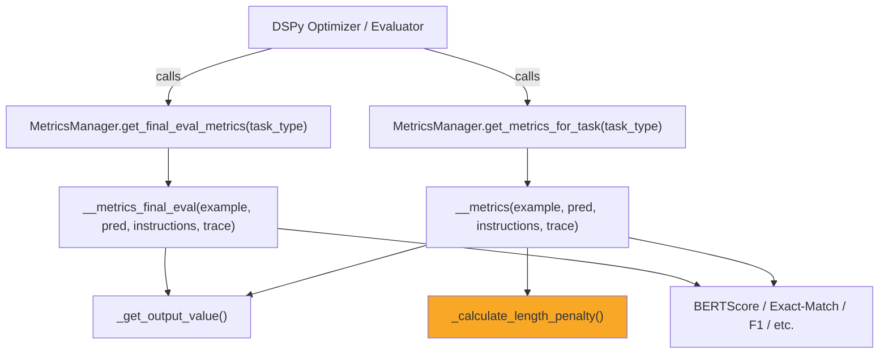

# `metrics.py` — Detailed Walkthrough

> [!NOTE]
> File: [metrics.py](file:///c:/Users/yoyob/OneDrive/Bureau/Ma2/MNLP/Test_project/promptomatix/src/promptomatix/metrics/metrics.py)
> ~1500 lines · 1 class (`MetricsManager`) · 40+ static methods

---

## 1. High-Level Purpose

This module is the **evaluation engine** of Promptomatix. It answers the question:

> *"Given a gold-standard example and a model prediction, how good is the prediction — and how efficiently was it produced?"*

It provides **task-aware scoring functions** that the DSPy optimisation loop calls during training and final evaluation. Every metric returns a **single `float` in [0, 1]**.

---

## 2. Architecture Overview



The class is **entirely static** — no instances are created. State is limited to a single class variable (`_output_fields`) set once at startup.

---

## 3. Module-Level Setup (Lines 1–50)

### 3.1 Warning Suppression
```python
os.environ['TRANSFORMERS_VERBOSITY'] = 'error'
os.environ['TOKENIZERS_PARALLELISM'] = 'false'
warnings.filterwarnings("ignore")
```
BERTScore loads a HuggingFace transformer model the first time it runs, which is very noisy. The module silences all of that.

### 3.2 Silent BERTScore Wrapper
```python
def bert_score_silent(*args, **kwargs):
    with suppress_stderr():
        with warnings.catch_warnings():
            warnings.simplefilter("ignore")
            return bert_score_original(*args, **kwargs)
```
`bert_score_metric` is the module-level alias used everywhere. It redirects `stderr` to `/dev/null` so console output stays clean.

---

## 4. Configuration — `configure()` and `_get_output_value()`

### 4.1 `configure(output_fields)` — [Line 56](file:///c:/Users/yoyob/OneDrive/Bureau/Ma2/MNLP/Test_project/promptomatix/src/promptomatix/metrics/metrics.py#L56)

Called **once** at startup with the list of output field names (e.g. `["answer"]`, `["summary"]`, `["label"]`). These are stored in `MetricsManager._output_fields` and reused by every metric.

### 4.2 `_get_output_value(item)` — [Line 65](file:///c:/Users/yoyob/OneDrive/Bureau/Ma2/MNLP/Test_project/promptomatix/src/promptomatix/metrics/metrics.py#L65)

This is the **universal value extractor**. Given either a `dict` or an object:

1. Iterates over `_output_fields` and collects every field that exists on `item`.
2. Lowercases and strips each value.
3. Joins them with a space → returns a single string.

> **Example:** If `_output_fields = ["answer"]` and `item = {"answer": "Paris"}`, it returns `"paris"`.

This lets every metric function be **field-agnostic** — they don't need to know whether the output field is called `answer`, `label`, `summary`, etc.

---

## 5. The Two Dispatch Tables

### 5.1 `get_metrics_for_task(task_type)` — [Line 85](file:///c:/Users/yoyob/OneDrive/Bureau/Ma2/MNLP/Test_project/promptomatix/src/promptomatix/metrics/metrics.py#L85)

Returns the **training metric** function. These metrics **include a length penalty** that penalises long prompts — the optimizer should prefer shorter prompts that achieve the same quality.

### 5.2 `get_final_eval_metrics(task_type)` — [Line 129](file:///c:/Users/yoyob/OneDrive/Bureau/Ma2/MNLP/Test_project/promptomatix/src/promptomatix/metrics/metrics.py#L129)

Returns the **final evaluation metric** function. These **do NOT include the length penalty** (or include it depending on the task), giving a pure quality signal.

Both tables map 20 task types to their respective functions. The fallback is `_qa_metrics` / `_qa_metrics_final_eval`.

### Supported Task Types

| Category | Task Types |
|---|---|
| **Core NLP** | `qa`, `classification`, `generation`, `summarization`, `translation` |
| **Multi-label** | `multi_label_classification` |
| **Extraction** | `information_extraction` |
| **Rewriting** | `paraphrasing` |
| **Dialogue** | `conversation`, `negotiation` |
| **Code** | `code_generation`, `code_explanation`, `code_completion`, `code_debugging` |
| **Agentic** | `planning`, `tool_use`, `decision_making`, `process_automation` |
| **Analytical** | `recommendation`, `data_analysis` |

---

## 6. The Length Penalty — `_calculate_length_penalty()` — [Line 171](file:///c:/Users/yoyob/OneDrive/Bureau/Ma2/MNLP/Test_project/promptomatix/src/promptomatix/metrics/metrics.py#L171)

This is the key mechanism that makes the optimizer prefer **shorter, more efficient prompts**.

### Formula

$$\text{length\_penalty} = e^{-\lambda \cdot L}$$

Where:
- **λ** = `LambdaPenalty.get_value()` (default `0.005`, configurable via `Config(lambda_penalty=...)`)
- **L** = word count of the `instructions` (the system prompt / instruction text)

### Vision Token Economics

If the example contains an image (detected via `image_context`, `image`, `images`, `image_url`, or `image_path` keys), **258 tokens are added** to `L`. This accounts for the static cost of encoding an image with models like Gemini/OpenAI.

```python
if has_image:
    prompt_length += 258  # Standard vision model base cost
```

### Effect

| Prompt Length (words) | λ=0.005 | Penalty |
|---|---|---|
| 0 | 0.005 | 1.000 |
| 50 | 0.005 | 0.778 |
| 100 | 0.005 | 0.607 |
| 200 | 0.005 | 0.368 |
| 500 | 0.005 | 0.082 |

The penalty is **multiplied** into the final score: `score * length_penalty`. So a 200-word prompt reduces the effective score to ~37% of its raw quality — strongly incentivising brevity during optimisation.

> [!IMPORTANT]
> The **`_final_eval`** variants of most metrics **omit** the length penalty, so the final reported score reflects pure quality.

---

## 7. Task-Specific Metric Functions — In Detail

Every metric function has the same signature:

```python
def _<task>_metrics(example, pred, instructions=None, trace=None) -> float
```

- `example` — the gold-standard item (dict or object)
- `pred` — the model's prediction (dict or object)
- `instructions` — the prompt/instructions text (used for length penalty)
- `trace` — DSPy trace object (unused but required by DSPy's API)

### 7.1 QA (`_qa_metrics`) — [Line 190](file:///c:/Users/yoyob/OneDrive/Bureau/Ma2/MNLP/Test_project/promptomatix/src/promptomatix/metrics/metrics.py#L190)

```
score = ((exact_match + BERTScore_F1) / 2) × length_penalty
```

1. Extracts `pred_answer` and `gold_answer` via `_get_output_value()`.
2. Handles `####`-delimited answers (common in GSM8K math datasets) — takes only the part after `####`.
3. Computes **exact match** (binary 0/1).
4. Computes **BERTScore F1** between pred and gold.
5. Averages them and multiplies by the length penalty.

### 7.2 Classification (`_classification_metrics`) — [Line 234](file:///c:/Users/yoyob/OneDrive/Bureau/Ma2/MNLP/Test_project/promptomatix/src/promptomatix/metrics/metrics.py#L234)

```
score = exact_match × length_penalty
```

Pure exact match (case-insensitive). Either 0 or 1.

### 7.3 Generation (`_generation_metrics`) — [Line 252](file:///c:/Users/yoyob/OneDrive/Bureau/Ma2/MNLP/Test_project/promptomatix/src/promptomatix/metrics/metrics.py#L252)

```
score = ((fluency + creativity + similarity) / 3) × length_penalty
```

Uses **3 separate BERTScore calls** against different references:
- **Fluency**: scored against the static reference *"This is a well-written, grammatically correct, and flowing text."*
- **Creativity**: scored against *"This is a unique, novel, and imaginative piece of writing with original ideas."*
- **Similarity**: scored against the **gold text**.

> [!NOTE]
> The fluency and creativity scores are **proxy signals** — BERTScore measures semantic similarity to a description of the desired quality, not the quality directly. This is an approximate but useful heuristic.

### 7.4 Summarization (`_summarization_metrics`) — [Line 278](file:///c:/Users/yoyob/OneDrive/Bureau/Ma2/MNLP/Test_project/promptomatix/src/promptomatix/metrics/metrics.py#L278)

```
score = BERTScore_F1(pred, gold) × length_penalty
```

Straightforward BERTScore F1 between predicted and gold summaries.

### 7.5 Translation (`_translation_metrics`) — [Line 308](file:///c:/Users/yoyob/OneDrive/Bureau/Ma2/MNLP/Test_project/promptomatix/src/promptomatix/metrics/metrics.py#L308)

```
score = BERTScore_F1(pred, gold, lang=auto) × length_penalty
```

Key difference: **automatic language detection** using `langdetect`. Detects the language of the prediction, maps it to a BERTScore-supported language code (de, fr, es, it, nl, zh, ja, ko, ru), and uses `distilbert-base-multilingual-cased` as the model. Falls back to English.

### 7.6 Multi-Label Classification (`_multi_label_classification_metrics`) — [Line 616](file:///c:/Users/yoyob/OneDrive/Bureau/Ma2/MNLP/Test_project/promptomatix/src/promptomatix/metrics/metrics.py#L616)

```
score = ((F1 + Hamming_similarity) / 2) × length_penalty
```

1. Splits comma-separated labels into sets, strips brackets and quotes.
2. Computes set-based **F1** (precision/recall over label sets).
3. Computes **Hamming similarity** (fraction of labels correctly present/absent).
4. Averages them.

### 7.7 Information Extraction (`_information_extraction_metrics`) — [Line 655](file:///c:/Users/yoyob/OneDrive/Bureau/Ma2/MNLP/Test_project/promptomatix/src/promptomatix/metrics/metrics.py#L655)

```
score = ((regex_F1 + BERTScore_structure) / 2) × length_penalty
```

1. Extracts `"key": "value"` pairs via regex from both gold and predicted text.
2. Computes set-based F1 over extracted key-value pairs.
3. Also computes BERTScore between the raw text for structural similarity.

### 7.8 Paraphrasing (`_paraphrasing_metrics`) — [Line 693](file:///c:/Users/yoyob/OneDrive/Bureau/Ma2/MNLP/Test_project/promptomatix/src/promptomatix/metrics/metrics.py#L693)

```
score = (0.7 × BERTScore_similarity + 0.3 × lexical_diversity) × length_penalty
```

Rewards paraphrases that are **semantically similar** (70% weight) but **lexically different** (30% weight). Lexical diversity = `1 - Jaccard(gold_words, pred_words)`.

### 7.9 Conversation & Negotiation — [Lines 727, 760](file:///c:/Users/yoyob/OneDrive/Bureau/Ma2/MNLP/Test_project/promptomatix/src/promptomatix/metrics/metrics.py#L727)

Both follow the **dual-reference pattern**:
```
score = ((BERTScore_vs_gold + BERTScore_vs_quality_ref) / 2) × length_penalty
```

- **Conversation** uses a coherence reference: *"This is a coherent, contextually appropriate, and well-structured response."*
- **Negotiation** uses an effectiveness reference: *"This response demonstrates effective negotiation strategy, maintains fairness, and works toward mutual agreement."*

### 7.10 Code Tasks (4 variants) — [Lines 793–922](file:///c:/Users/yoyob/OneDrive/Bureau/Ma2/MNLP/Test_project/promptomatix/src/promptomatix/metrics/metrics.py#L793)

All 4 (`code_generation`, `code_explanation`, `code_completion`, `code_debugging`) use the same dual-reference pattern:
```
score = ((BERTScore_vs_gold + BERTScore_vs_quality_ref) / 2) × length_penalty
```

Each has a task-specific quality reference string (e.g., for debugging: *"This debug solution correctly identifies and fixes the bugs while maintaining code functionality."*).

### 7.11 Agentic Tasks (4 variants) — [Lines 924–1054](file:///c:/Users/yoyob/OneDrive/Bureau/Ma2/MNLP/Test_project/promptomatix/src/promptomatix/metrics/metrics.py#L924)

`planning`, `tool_use`, `decision_making`, `process_automation` — same dual-reference pattern with task-specific quality reference strings.

### 7.12 Analytical Tasks — [Lines 1090–1153](file:///c:/Users/yoyob/OneDrive/Bureau/Ma2/MNLP/Test_project/promptomatix/src/promptomatix/metrics/metrics.py#L1090)

`recommendation`, `data_analysis` — same dual-reference pattern.

---

## 8. The `_final_eval` Variants (Lines 450–1501)

For **every** task-specific metric above, there is a corresponding `_<task>_metrics_final_eval` method. These are **functionally identical** to the training metrics **except**:

| Aspect | Training Metric | Final Eval Metric |
|---|---|---|
| Length penalty | ✅ Applied | ❌ Not applied (pure quality) |
| Use case | DSPy optimizer loop | Post-optimization evaluation |

> [!TIP]
> The two-tier system means the optimizer is incentivised to find short, efficient prompts during training, but the final reported score reflects only how well the model actually answered.

---

## 9. Utility Methods

### 9.1 `get_detailed_metrics()` — [Line 400](file:///c:/Users/yoyob/OneDrive/Bureau/Ma2/MNLP/Test_project/promptomatix/src/promptomatix/metrics/metrics.py#L400)

Returns a **dictionary** of individual metric components (not a single score) for analysis purposes. Only implemented for `qa`, `generation`/`summarization`, and a default case:

- **QA**: `{exact_match, f1, combined_score}` — uses token-level F1 (not BERTScore).
- **Generation/Summarization**: `{rouge-1, rouge-2, rouge-l, rouge_avg}` — uses ROUGE scores.
- **Default**: `{accuracy}` — exact match.

### 9.2 `_default_metrics()` / `_default_metrics_final_eval()` — [Lines 359, 600](file:///c:/Users/yoyob/OneDrive/Bureau/Ma2/MNLP/Test_project/promptomatix/src/promptomatix/metrics/metrics.py#L359)

Fallback for unknown task types. Simple exact-match comparison.

---

## 10. Scoring Formula Summary

| Task Type | Training Score Formula |
|---|---|
| `qa` | `((EM + BERTScore_F1) / 2) × penalty` |
| `classification` | `EM × penalty` |
| `generation` | `((fluency + creativity + similarity) / 3) × penalty` |
| `summarization` | `BERTScore_F1 × penalty` |
| `translation` | `BERTScore_F1(multilingual) × penalty` |
| `multi_label_classification` | `((F1 + Hamming) / 2) × penalty` |
| `information_extraction` | `((regex_F1 + BERTScore) / 2) × penalty` |
| `paraphrasing` | `(0.7×BERTScore + 0.3×lexical_diversity) × penalty` |
| `conversation` | `((BERTScore_gold + BERTScore_coherence) / 2) × penalty` |
| `negotiation` | `((BERTScore_gold + BERTScore_effectiveness) / 2) × penalty` |
| Code tasks (×4) | `((BERTScore_gold + BERTScore_quality) / 2) × penalty` |
| Agentic tasks (×4) | `((BERTScore_gold + BERTScore_quality) / 2) × penalty` |
| Analytical tasks (×2) | `((BERTScore_gold + BERTScore_quality) / 2) × penalty` |

Where `penalty = e^(-λ × prompt_word_count)` and `λ` defaults to `0.005`.

---

## 11. Key Design Observations

1. **BERTScore is the backbone.** Nearly every metric relies on it. This gives semantic similarity rather than just string matching, which is critical for open-ended NLP tasks.

2. **The "quality reference" pattern is a creative heuristic.** For tasks like code generation or planning, BERTScore is computed against a *description of ideal output* (e.g., *"This code follows best practices…"*). This is an approximate signal — it measures how similar the output's language is to a description of quality, not quality itself.

3. **The length penalty creates an efficiency pressure.** During training, the optimizer can't just make prompts arbitrarily long — the exponential decay strongly penalises verbosity.

4. **Every function is wrapped in try/except.** On failure, `0.0` is returned. This prevents a single bad example from crashing the entire optimization run.

5. **The code is highly repetitive.** The `_final_eval` variants are near-copies of the training variants with the penalty removed. This is a deliberate trade-off for explicitness over DRY.
